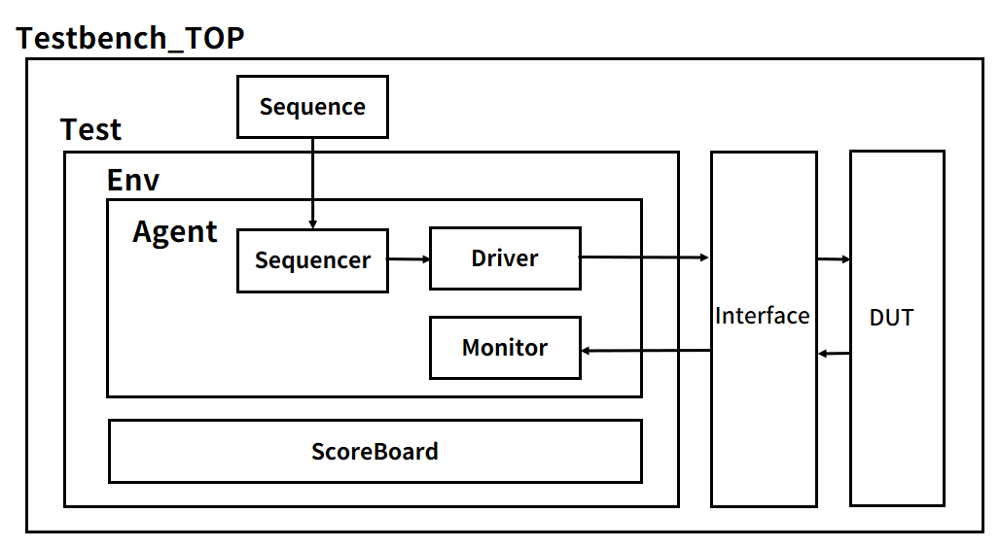

# 🔄 AXI Protocol 기반 SPI & I2C 통신 모듈 설계 및 UVM 검증

> SPI·I2C Master/Slave 통신 모듈을 설계하고, UVM 기반 검증과 AXI-Lite 연동을 통해 실제 동작 환경에서 기능을 검증한 프로젝트


---

## 📋 프로젝트 개요

SPI·I2C Master/Slave 통신 모듈을 설계하고, UVM 기반 검증과 AXI-Lite 연동을 통해 실제 동작 환경에서 기능을 검증한 프로젝트입니다.

### 🎯 주요 목표
- SPI Master/Slave 통신 모듈 설계
- I2C Master를 AXI-Lite 버스로 제어할 수 있도록 레지스터 맵 구성 및 MicroBlaze 연동
- SPI 검증 환경을 UVM으로 구축 (Sequence-Driver-Monitor-Scoreboard 구조 구성)

---

## ✨ 주요 기능

### 1. SPI 통신 모듈
- **SPI Master/Slave** 모듈 로직 설계
- **I2C Master**를 AXI-Lite 버스로 제어
- 레지스터 맵 구성 및 **MicroBlaze** 연동

### 2. UVM 검증 환경
- **SPI 검증 환경**을 UVM으로 구축
- **UVM Scoreboard**의 **Golden/Actual** 비교 구조로 **SPI데이터 오류를 빠짐 단위로 즉시 검출**
- **SPI·I2C 통신 경로**를 실제 환경 **(FPGA + MicroBlaze)**에서 정상 동작 검증

### 3. FPGA 실제 동작
- SPI Mode 0~3(CPOL/CPHA) 전 조합의 **Read/Write 기능**을 자동화 검증하여 모든 시나리오 **PASS** 확인

---

## 🏗️ 시스템 아키텍처

### 📊 I2C Block Diagram
```
┌───────────────┐       ┌─────────────┐     ┌─────────────┐      ┌──────────┐
│ CPU/MicroBlaze│─────▶│  AXI 4      │────▶│ I2C Master  │────▶│   SCL    │
│               │       │             │     │   (CR/ODR/  │      │   SDA    │
│               │       │             │     │   IDR/STR)  │      │          │
└───────────────┘       └─────────────┘     └─────────────┘      └──────────┘
                                                   │
                                                   ▼
                                              I2C Slave
                                               (LED)
```

### 📊 SPI UVM 검증 환경
<p align="center">
  
</p>

---

## 🔧 개발 환경

|       항목       | 사양 |
|------------------|------|
|   **Language**   | SystemVerilog (UVM) |
|     **Tool**     | Vivado, VCS (UVM Simulation) |
|     **FPGA**     | Basys3 (Xilinx) |
|      **CPU**     | MicroBlaze (AXI-Lite) |
| **Verification** | UVM Testbench, Scoreboard |

---

## 📈 성능 지표

### ✅ 검증 결과
- **SPI Mode 0~3(CPOL/CPHA)** 전 조합의 **Read/Write 기능**을 자동화 검증하여 모든 시나리오 **PASS** 확인
- **UVM Scoreboard**의 **Golden/Actual** 비교 구조로 **SPI데이터 오류를 빠짐 단위로 즉시 검출**
- **SPI·I2C 통신 경로**를 실제 환경 **(FPGA + MicroBlaze)**에서 정상 동작 검증

### 🐛 Trouble Shooting

#### 문제: 랜덤 시퀀스 수행 중 Sequence 진송 속도가 빠름
- **원인**: Driver 처리 지연으로 **데이터 누락 발생**
- **해결**: Driver 처리 완료 시점 기준으로 **get_next_item()-item_done() 호출**을 고정해, **Sequence-Driver 간 트랜잭션 동기화**를 명확히 함

---

## 📁 프로젝트 구조

```
AXI-SPI-I2C-UVM/
├── rtl/                    # RTL 소스 코드
│   ├── spi_master.v
│   ├── spi_slave.v
│   ├── i2c_master.v
│   └── axi_lite_wrapper.v
├── tb/                     # UVM Testbench
│   ├── spi_agent/
│   │   ├── spi_driver.sv
│   │   ├── spi_monitor.sv
│   │   └── spi_sequencer.sv
│   ├── spi_env.sv
│   ├── spi_scoreboard.sv
│   └── tb_top.sv
├── images/                 # 문서용 이미지
└── README.md
```

---

## 🚀 사용 방법

### 1. UVM 시뮬레이션 실행
```bash
# VCS UVM 시뮬레이션
vcs -sverilog -ntb_opts uvm-1.2 -full64 -R \
    rtl/*.v tb/*.sv \
    -debug_access+all
```

### 2. FPGA 합성 및 MicroBlaze 연동
```tcl
# Vivado에서 Block Design 생성
# MicroBlaze + AXI-Lite + I2C Master 연결
```

### 3. SPI 모드 테스트
```systemverilog
// MODE 0: CPOL=0, CPHA=0
// MODE 1: CPOL=0, CPHA=1
// MODE 2: CPOL=1, CPHA=0
// MODE 3: CPOL=1, CPHA=1
```

---

## 📚 참고 자료

- [SPI Protocol Specification](https://www.analog.com/en/analog-dialogue/articles/introduction-to-spi-interface.html)
- [I2C Specification](https://www.nxp.com/docs/en/user-guide/UM10204.pdf)
- [UVM 1.2 User Guide](https://www.accellera.org/downloads/standards/uvm)
- [AXI4-Lite Specification](https://developer.arm.com/documentation/ihi0022/latest/)

---

## 👤 Author

**이서영 (Lee Seoyoung)**
- 📧 Email: lsy1922@naver.com
- 🔗 GitHub: [@seoY0206](https://github.com/seoY0206)

---

## 📝 License

This project is for educational purposes.

---

<div align="center">

**⭐ 도움이 되었다면 Star를 눌러주세요! ⭐**

</div>
